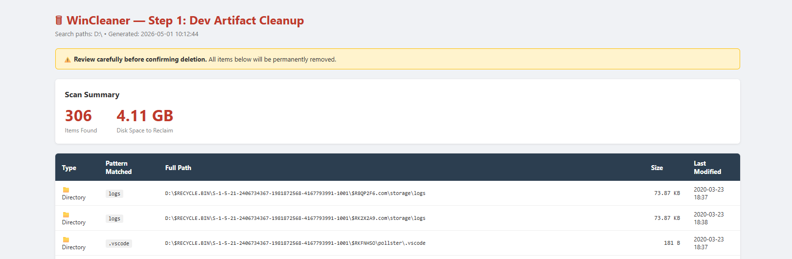
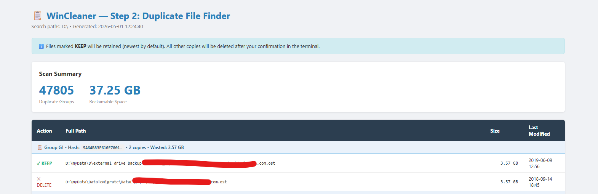
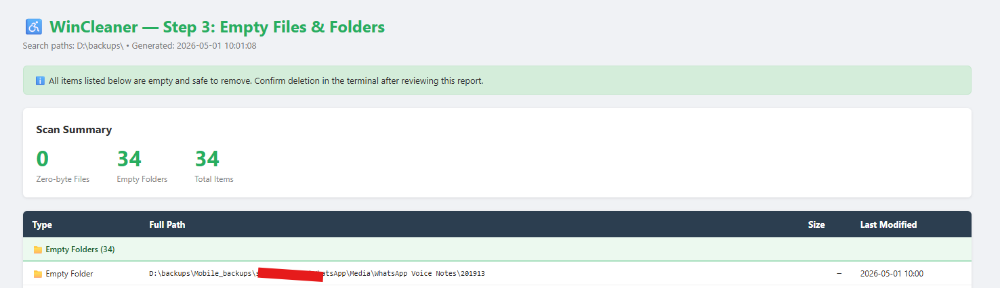

# win-cleaner

A PowerShell toolkit for Windows developers to reclaim disk space by removing dev build artifacts, duplicate files, and empty items — with HTML reports and confirmation before any deletion.

---

## Scripts & Files

| File | Description |
|---|---|
| `WinCleaner.ps1` | **Master script** — interactive menu to run all 3 steps |
| `Step1-DevFolderCleanup.ps1` | Remove dev artifact folders/files (node_modules, dist, .gradle, etc.) |
| `Step2-DuplicateFinder.ps1` | Find and remove duplicate files using SHA-256 hashing |
| `Step3-EmptyItemsCleanup.ps1` | Remove zero-byte files and empty directory trees |
| `cleanup-list.txt` | Patterns used by Step 1 (one pattern per line, supports wildcards) |
| `config.json` | **User configuration** — default scan paths, ignore names, ignore paths |

---

## Quick Start

```powershell
# Run the interactive master script (recommended)
.\WinCleaner.ps1

# Pre-set one or more search paths
.\WinCleaner.ps1 -SearchPaths "D:\Projects", "E:\Work"

# Preview only — generate reports without deleting anything
.\WinCleaner.ps1 -DryRun

# Jump directly to a specific step
.\WinCleaner.ps1 -Step 1
```

> **Default path:** Configured in `config.json` under `defaultScanPaths`. If you press Enter at the path prompt without providing input, those paths are used. Defaults to `D:\` if config is absent.

---

## Configuration — config.json

Edit `config.json` to customise behaviour without touching any script.

```json
{
  "defaultScanPaths": [
    "D:\\"
  ],

  "ignoreNames": [
    ".git",
    ".env"
  ],

  "ignorePaths": [
  ]
}
```

### Fields

| Field | Type | Description |
|---|---|---|
| `defaultScanPaths` | `string[]` | Paths used when no `-SearchPaths` argument is given and the user presses Enter at the prompt. Add as many drives or folders as needed. |
| `ignoreNames` | `string[]` | Exact folder or file **names** that are **never** deleted or reported, regardless of what `cleanup-list.txt` contains. `.git` and `.env` are protected by default. Anything nested inside a protected folder is also skipped. |
| `ignorePaths` | `string[]` | Full path **prefixes** to skip entirely. Any item whose full path starts with one of these strings is excluded. Useful for protecting specific project directories. |

### Examples

**Scan multiple drives by default:**
```json
"defaultScanPaths": ["D:\\", "E:\\Projects", "F:\\Work"]
```

**Protect additional sensitive files/folders:**
```json
"ignoreNames": [".git", ".env", ".env.local", ".secrets", "credentials"]
```

**Exclude a specific directory from all scans:**
```json
"ignorePaths": ["D:\\ImportantProject", "E:\\DoNotTouch"]
```

---

## How It Works

### Step 1 — Dev Artifact Cleanup

Scans for folders and files matching patterns in `cleanup-list.txt`. Patterns cover all major ecosystems:

- **Node.js / Frontend:** `node_modules`, `.next`, `.nuxt`, `.turbo`, `dist`, `coverage`, `.cache`
- **Python:** `__pycache__`, `.venv`, `venv`, `.mypy_cache`, `.pytest_cache`, `*.egg-info`
- **Java / Gradle / Maven:** `target`, `.gradle`, `build`, `.mvn`
- **.NET:** `bin`, `obj`, `.vs`, `TestResults`
- **Rust / Go:** `target`, `pkg`
- **Ruby:** `vendor`, `.bundle`, `log`, `tmp`
- **Android:** `.gradle`, `captures`, `.externalNativeBuild`
- **iOS / Xcode:** `DerivedData`, `xcuserdata`, `xcshareddata`
- **Terraform / Serverless:** `.terraform`, `.serverless`, `.aws-sam`
- **ML / Data Science:** `.mlflow`, `.dvc`, `wandb`, `lightning_logs`, `checkpoints`
- **Docker:** `.docker`, `docker-data`
- **General:** `logs`, `log`, `tmp`, `temp`, `.cache`, `debug`, `htmlcov`

Items listed in `ignoreNames` or under `ignorePaths` in `config.json` are **always excluded** even if they match a pattern in `cleanup-list.txt`. Nested matches are also skipped automatically (e.g. `node_modules` inside `node_modules` is not double-counted).

```powershell
.\Step1-DevFolderCleanup.ps1 -SearchPaths "D:\Projects"
.\Step1-DevFolderCleanup.ps1 -SearchPaths "D:\Projects" -DryRun

# Specify a custom cleanup list
.\Step1-DevFolderCleanup.ps1 -CleanupListFile "C:\my-patterns.txt"
```



---

### Step 2 — Duplicate File Finder

Uses a two-phase approach for efficiency:
1. Groups all files by size — only same-size files proceed to hashing
2. Computes SHA-256 hash for candidates and identifies true duplicates

For each duplicate group you choose how to resolve it:

| Key | Action |
|---|---|
| `K` | Keep the **newest** file, delete older copies *(default)* |
| `O` | Keep the **oldest** file, delete newer copies |
| `S` | Skip this group — keep all copies |
| `A` | Apply **K** to all remaining groups automatically |

```powershell
.\Step2-DuplicateFinder.ps1 -SearchPaths "D:\Projects"

# Ignore files smaller than 100 KB
.\Step2-DuplicateFinder.ps1 -SearchPaths "D:\Projects" -MinSizeKB 100

.\Step2-DuplicateFinder.ps1 -SearchPaths "D:\Projects" -DryRun
```



---

### Step 3 — Empty Files & Folders Cleanup

Finds and removes:
- **Zero-byte files** (0 KB files that are stale or abandoned)
- **Empty directories** (folders containing no files anywhere in their subtree)

Directories are deduplicated before deletion — only the top-level empty parent is reported; nested empty subdirectories are removed as part of it.

```powershell
.\Step3-EmptyItemsCleanup.ps1 -SearchPaths "D:\Projects"

# Skip zero-byte files, only remove empty folders
.\Step3-EmptyItemsCleanup.ps1 -SearchPaths "D:\Projects" -SkipEmptyFiles

# Skip empty folders, only remove zero-byte files
.\Step3-EmptyItemsCleanup.ps1 -SearchPaths "D:\Projects" -SkipEmptyDirs

.\Step3-EmptyItemsCleanup.ps1 -SearchPaths "D:\Projects" -DryRun
```



---

## Safety

Every step follows a **report → review → confirm → delete** workflow:

1. Scans the target paths
2. Generates an **HTML report** and opens it in your browser
3. Waits for you to review
4. Requires you to type `DELETE` (exact, case-sensitive) to proceed
5. Saves a **text deletion log** alongside the report

No files are ever deleted without explicit confirmation.

**Reports and logs** are saved to a `Reports\` subfolder next to the scripts:
```
win-cleaner\
  Reports\
    Step1-DevArtifacts-20260501-143022.html
    Step1-DeletionLog-20260501-143022.txt
    Step2-Duplicates-20260501-143055.html
    Step2-DeletionLog-20260501-143055.txt
    Step3-EmptyItems-20260501-143120.html
    Step3-DeletionLog-20260501-143120.txt
```

---

## Requirements

- Windows PowerShell 5.1 or later
- No external modules required

---

## Customising `cleanup-list.txt`

Add or remove patterns (one per line). Wildcards are supported:

```
# My custom patterns
*.log
.DS_Store
Thumbs.db
my-temp-*
```

Lines starting with `#` are treated as comments and ignored.

> **Note:** Even if `.git` or `.env` appear in `cleanup-list.txt`, they will never be deleted — they are protected via `ignoreNames` in `config.json`.
